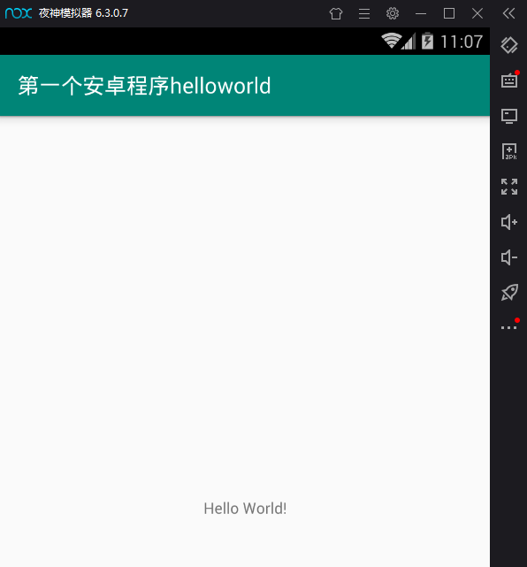
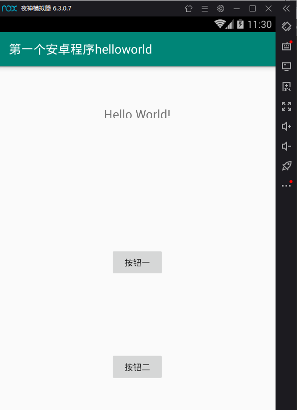
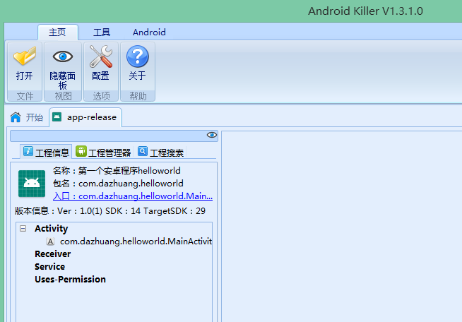

# reverse_android 从安卓开发到逆向
## 第一个安卓程序helloworld
1、创建一个项目，选择empty activity  
2、名称写第一个安卓项目helloworld,包名com.dazhuang.helloworld,设置保存位置，语言选择java，最低运行api选择安卓4.0版本，开始创建  
3、主要看三个文件，分别为AndroidManifest.xml，MainActivity.java，activity_main.xml  
```xml
<!-- AndroidManifest.xml 安卓全局描述文件 -->
<?xml version="1.0" encoding="utf-8"?>
<manifest xmlns:android="http://schemas.android.com/apk/res/android"
    package="com.dazhuang.helloworld">

    <application
        android:allowBackup="true"
        android:icon="@mipmap/ic_launcher"
        android:label="@string/app_name"
        android:roundIcon="@mipmap/ic_launcher_round"
        android:supportsRtl="true"
        android:theme="@style/AppTheme">
        <!-- activity标记,默认只有一个,一下代码用户配置.MainActivity为app的入口，app运行时，第一个看到的activity就是这个activity -->
        <activity android:name=".MainActivity">
            <intent-filter>
                <action android:name="android.intent.action.MAIN" />

                <category android:name="android.intent.category.LAUNCHER" />
            </intent-filter>
        </activity>
    </application>

</manifest>
```
```java
// MainActivity.java
package com.dazhuang.helloworld;

import androidx.appcompat.app.AppCompatActivity;

import android.os.Bundle;

// 定义了一个java类MainActivity，继承AppCompatActivity
public class MainActivity extends AppCompatActivity {

    // 重写oncreate方法
    @Override
    protected void onCreate(Bundle savedInstanceState) {
        super.onCreate(savedInstanceState);
        // 关键代码，指定布局文件显示，指定资源文件下的activity_main.xml显示，res下的layout下的activity_main.xml
        // R文件是自动生成的
        setContentView(R.layout.activity_main);
    }
}
```
```xml
<!-- activity_main.xml 项目的布局文件,控制窗口中显示的内容 -->
<?xml version="1.0" encoding="utf-8"?>
<androidx.constraintlayout.widget.ConstraintLayout xmlns:android="http://schemas.android.com/apk/res/android"
    xmlns:app="http://schemas.android.com/apk/res-auto"
    xmlns:tools="http://schemas.android.com/tools"
    android:layout_width="match_parent"
    android:layout_height="match_parent"
    tools:context=".MainActivity">

    <!-- 文本框组件 -->
    <TextView
        android:layout_width="wrap_content"
        android:layout_height="wrap_content"
        <!-- 设置属性值 -->
        android:text="Hello World!"
        app:layout_constraintBottom_toBottomOf="parent"
        app:layout_constraintLeft_toLeftOf="parent"
        app:layout_constraintRight_toRightOf="parent"
        app:layout_constraintTop_toTopOf="parent" />

</androidx.constraintlayout.widget.ConstraintLayout>
```
4、mipmap下放置项目使用的图标  
5、values下保存一些资源文件,如strings.xml保存着应用标题
```xml
<resources>
    <string name="app_name">第一个安卓程序helloworld</string>
</resources>
```
6、运行第一个安卓程序helloworld  
  
7、程序扩展，在原界面中添加按钮，打开activity_main.xml，切换到design视图页面，插入两个按钮并运行app  
  
8、生成apk,首先生成签名,点击build---generate signed apk，选择签名文件，如果没有则创建一个  
  
APK Destination Folder-----APK文件生成的目录,Build Type----生成release版还是debug版,Signature Version----对哪些部分进行签名,apk会生成在release目录下  
9、对刚刚生成的app-release.apk进行反编译，使用android killer工具  
  
点击工程管理器，可以看到反编译后的目录信息。  
```text
如遇到 APK 反编译失败，无法继续下一步源码反编译!，则需要升级apktool。
```
10、原MainActivity.java被反编译为MainActivity.smali  
```java
// MainActivity.smali
.class public Lcom/dazhuang/helloworld/MainActivity;
.super Landroidx/appcompat/app/AppCompatActivity;
.source "MainActivity.java"


# direct methods
.method public constructor <init>()V
    .locals 0
    // .line关键字就是用来描述当前代码在java源文件中的行数
    .line 7
    invoke-direct {p0}, Landroidx/appcompat/app/AppCompatActivity;-><init>()V

    return-void
.end method


# virtual methods
.method protected onCreate(Landroid/os/Bundle;)V
    .locals 0

    .line 11
    invoke-super {p0, p1}, Landroidx/appcompat/app/AppCompatActivity;->onCreate(Landroid/os/Bundle;)V

    const p1, 0x7f0a001c

    .line 12
    invoke-virtual {p0, p1}, Lcom/dazhuang/helloworld/MainActivity;->setContentView(I)V

    return-void
.end method
```
11、smali基础语法：  
```text
.class <访问权限><类名>
.super <父类名>
.source <源文件名>经过混淆后，本项可能为空

类变量声明：
.field <访问权限> <变量名>:<变量类型>

局部变量声明：
.local <初始值>,<变量名>:<变量类型>

示例:
 .local v0, "ans":Ljava/lang/String; 对应源码为 String ans = "";

类方法声明:
.method <访问权限><方法名>(参数原型)<方法原型>
    .prologue 指定代码开始位置
    .param 指定方法参数
    .line 指定代码在源代码中的行数，混淆后可能不存在
    .locals 使用局部变量个数
.end method 方法结束

示例：
.method public onTabReselected(Landroid/app/ActionBar$Tab;Landroid/app/FragmentTransaction;)V 
    .locals 0
    .param p1, "tab"    # Landroid/app/ActionBar$Tab; 
    .param p2, "fragmentTransaction"    # Landroid/app/FragmentTransaction;   
    .prologue 
    .line 55     //可能经过混淆后不存在
    return-void
.end method 
<=对应源码=>
public void onTabReselected(ActionBar$Tab tab, FragmentTransaction fragmentTransaction){
}

原始类型：
B—byte
C—char
D—double
F—float
I—int
J—long
S—short
V—void
Z—boolean
[XXX—array
Lpackage/name/ObjName—object  // 前面表示对象所在包路径

传入的参数寄存器：
由p表示，而函数内的本地寄存器则由V表示，多个的话在后面加上0,1,2，需要注意的是，在非static函数中,p0表示this，p1才表示第一个参数。

常量赋值：
const                   v0, 0x7F030018  # R.layout.activity_challenge   #从R中取出静态值
const/4                 v3, 0x2   #4也可以换成16或者high16，表示取整数值
const-string            v2, "Challenge"  # 取字符串
const-class             v2, Context    #把类对象取出

变量间赋值:
move  vx,vy   # 将vy的值赋值给vx，也可以是move-object等
move-result vx  # 将上个方法调用后的结果赋值给vx，也可以是move-result-object
return-object vx # 将vx的对象作为函数返回值
new-instance            v0, ChallengePagerAdapter  # 实例化一个对象存入v0中

对象赋值:
iput-object             a,(this),b   将a的值给b，一般用于b的初始化
iget-object             a,(this),b   将b的值给a，一般用于获取b的地址，接着调用它
# eg.
iput-object             v0, p0, ChallengeActivity->actionBar:ActionBar
iget-object             v0, p0, ChallengeActivity->actionBar:ActionBar

函数操作:
1.private：invoke-direct
2.public|protected： invoke-virtual
3.static：invoke-static
4.parent:  invoke-super
基本调用形式：invoke-xxx {参数},类;->函数(参数原型)
# eg.
invoke-super {p0, p1}, Landroid/support/v4/app/FragmentActivity;->onCreate(Landroid/os/Bundle;)V
<=对应源码=>
super.onCreate(savedInstanceState);  // 其中p0是this，其父类是FragmentActivity，p1,是savedInstanceState，其原型是Bundle；即调用p0->onCreate(p1)

判断语句：
if-eq vA, vB, :cond_X   如果vA等于vB则跳转到:cond_X
if-ne vA, vB, :cond_X   如果vA不等于vB则跳转到:cond_X
if-lt vA, vB, :cond_X   如果vA小于vB则跳转到:cond_X
if-ge vA, vB, :cond_X   如果vA大于等于vB则跳转到:cond_X
if-gt vA, vB, :cond_X   如果vA大于vB则跳转到:cond_X
if-le vA, vB, :cond_X   如果vA小于等于vB则跳转到:cond_X
if-eqz vA, :cond_X      如果vA等于0则跳转到:cond_X
if-nez vA, :cond_X      如果vA不等于0则跳转到:cond_X
if-ltz vA, :cond_X      如果vA小于0则跳转到:cond_X
if-gez vA, :cond_X      如果vA大于等于0则跳转到:cond_X
if-gtz vA, :cond_X      如果vA大于0则跳转到:cond_X
if-lez vA, :cond_X      如果vA小于等于0则跳转到:cond_X

循环语句：
public void encrypt(String str) {
    String ans = "";
    for (int i = 0 ; i < str.length();i++){
        ans += str.charAt(i);
    }
    Log.e("ans:",ans);
}
<=对应smali=>
# public void encrypt(String str) {
.method public encrypt(Ljava/lang/String;)V 
.locals 4 
.param p1, "str"# Ljava/lang/String;
.prologue 
# String ans = "";
const-string v0, "" 
.local v0, "ans":Ljava/lang/String; 
# for (int i  0 ; i < str.length();i++){
# int i=0 =>v1
const/4 v1, 0x0
.local v1, "i":I
:goto_0# for_start_place
# str.length()=>v2
invoke-virtual {p1}, Ljava/lang/String;->length()I
move-result v2 
# i<str.length() 
if-ge v1, v2, :cond_0 
# ans += str.charAt(i); 
# str.charAt(i) => v2
new-instance v2, Ljava/lang/StringBuilder; 
invoke-direct {v2}, Ljava/lang/StringBuilder;-><init>()V
invoke-virtual {v2, v0}, Ljava/lang/StringBuilder;->append(Ljava/lang/String;)Ljava/lang/StringBuilder;
move-result-object v2 
#str.charAt(i) => v3
invoke-virtual {p1, v1}, Ljava/lang/String;->charAt(I)C 
move-result v3
# ans += v3 =>v0
invoke-virtual {v2, v3}, Ljava/lang/StringBuilder;->append(C)Ljava/lang/StringBuilder; 
move-result-object v2 
invoke-virtual {v2}, Ljava/lang/StringBuilder;->toString()Ljava/lang/String;
move-result-object v0
# i++
add-int/lit8 v1, v1, 0x1
goto :goto_0
# Log.e("ans:",ans);
:cond_0
const-string v2, "ans:" 
invoke-static {v2, v0}, Landroid/util/Log;->e(Ljava/lang/String;Ljava/lang/String;)I
return-void 
.end method

switch语句：
public void encrypt(int flag) {
        String ans = null;
        switch (flag){
            case 0:
                ans = "ans is 0";
                break;
            default:
                ans = "noans";
                break;
        }
        Log.v("ans:",ans);
    }
<=对应smali=>
#public void encrypt(int flag) {
.method public encrypt(I)V 
    .locals 2
    .param p1, "flag"    # I
    .prologue
#String ans = null;
    const/4 v0, 0x0
    .local v0, "ans":Ljava/lang/String;
#switch (flag){
    packed-switch p1, :pswitch_data_0 # pswitch_data_0指定case区域的开头及结尾
#default: ans="noans"
    const-string v0, "noans"
#Log.v("ans:",ans)
    :goto_0
    const-string v1, "ans:"
    invoke-static {v1, v0}, Landroid/util/Log;->v(Ljava/lang/String;Ljava/lang/String;)I
    return-void
#case 0: ans="ans is 0"
    :pswitch_0      #pswitch_<case的值>
    const-string v0, "ans is 0"
    goto :goto_0  # break
    nop
    :pswitch_data_0 #case区域的结束
    .packed-switch 0x0   #定义case的情况
        :pswitch_0   #case 0
    .end packed-switch
.end method

try-catch语句：
public void encrypt(int flag) {
    String ans = null;
    try {
        ans = "ok!";
    } catch (Exception e){
        ans = e.toString();
    }
    Log.d("error",ans);
}
<=对应smali=>
#public void encrypt(int flag) {
.method public encrypt(I)V
    .locals 3
    .param p1, "flag"    # I
    .prologue
#String ans = null;
    const/4 v0, 0x0
    .line 20
    .local v0, "ans":Ljava/lang/String;
#try { ans="ok!"; }
    :try_start_0  # 第一个try开始，
    const-string v0, "ok!"
    :try_end_0   # 第一个try结束(主要是可能有多个try)
    .catch Ljava/lang/Exception; {:try_start_0 .. :try_end_0} :catch_0
#Log.d("error",ans);
    :goto_0
    const-string v2, "error"
    invoke-static {v2, v0}, Landroid/util/Log;->d(Ljava/lang/String;Ljava/lang/String;)I
    return-void
#catch (Exception e){ans = e.toString();}
    :catch_0 #第一个catch
    move-exception v1
    .local v1, "e":Ljava/lang/Exception;
    invoke-virtual {v1}, Ljava/lang/Exception;->toString()Ljava/lang/String;
    move-result-object v0
    goto :goto_0
.end method
```
以上参考：https://www.anquanke.com/post/id/85035