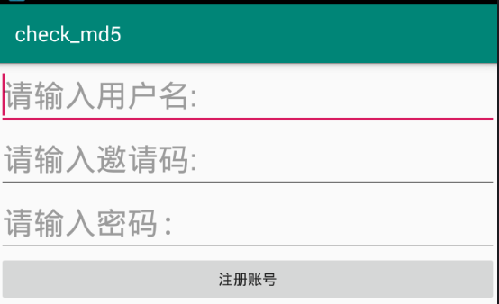
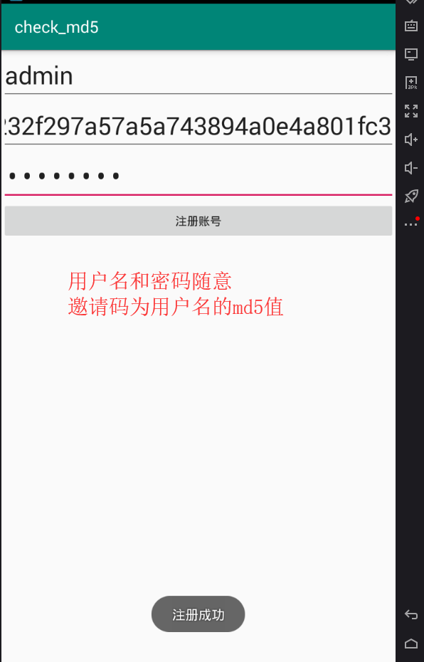
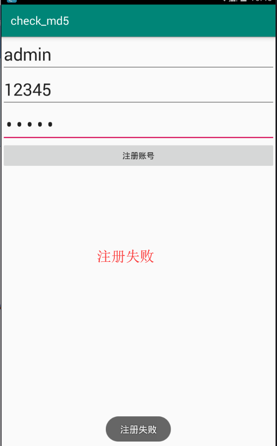

# reverse_android 从安卓开发到逆向
## check_md5 smali插桩，动态调试
### 准备工具
```text
android killer，android studio，夜神模拟器，adb
```
### app界面
  
### 实现代码  
```java
//        匿名类
        btn_register.setOnClickListener(new OnClickListener() {

            public void onClick(View v) {
//                注册失败
                if (!checkSN(edit_userName.getText().toString().trim(),edit_sn.getText().toString().trim(),edit_password.getText().toString().trim())){
                    Toast.makeText(MainActivity.this,
                            R.string.unsuccessed, Toast.LENGTH_SHORT).show();
                } else {
//                    注册成功
                    Toast.makeText(MainActivity.this,
                            R.string.successed, Toast.LENGTH_SHORT).show();
                }
            }
        });
    }

//    校验
    public static Boolean checkSN(String str,String SN,String password) {
        if (str == null || str.length() == 0) {
            return false;
        }

        if (password == null || password.length() == 0) {
            return false;
        }

        if (SN == null || SN.length() == 0) {
            return false;
        }

//        md5
        StringBuffer hexString = new StringBuffer();
        try {
            MessageDigest md = MessageDigest.getInstance("MD5");
            md.update(str.getBytes());
            byte[] hash = md.digest();
            for (int i = 0; i < hash.length; i++) {
                if ((0xff & hash[i]) < 0x10) {
                    hexString.append("0" + Integer.toHexString((0xFF & hash[i])));
                } else {
                    hexString.append(Integer.toHexString(0xFF & hash[i]));
                }
            }
        } catch (NoSuchAlgorithmException e) {
            e.printStackTrace();
            return false;
        }
        if (hexString.toString().equals(SN)){
            return true;
        }else{
            return false;
        }
    }
}
```  
### 实现步骤
#### 1、开发相关app，实现点击按钮后信息注册  
注册成功  
  
注册失败  
  
#### 2、使用android killer逆向apk为smali  

***
#### 微信公众号
不定期分享一些python爬虫,逆向破解相关文章,欢迎大家关注.  

***
BUG：dazhuang_python@sina.com