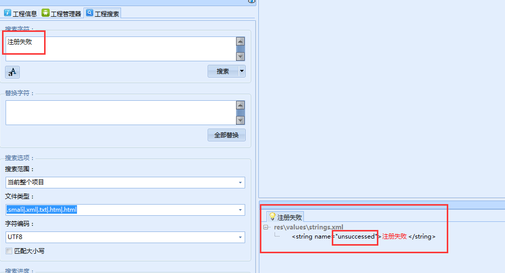
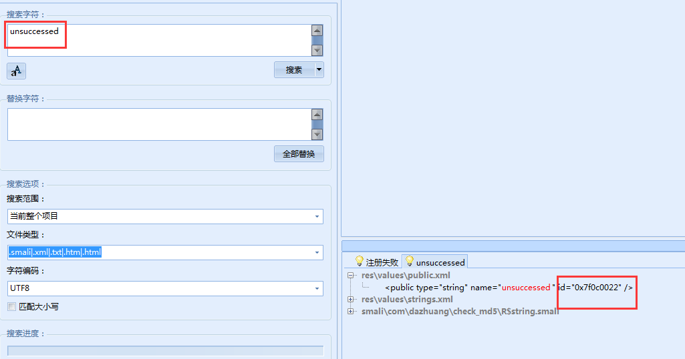
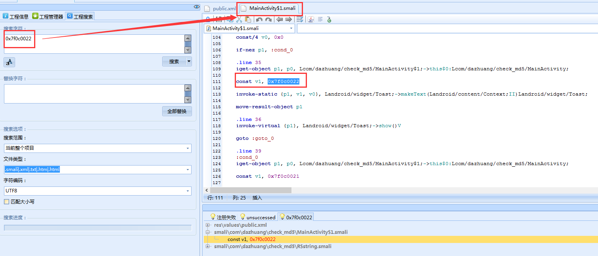
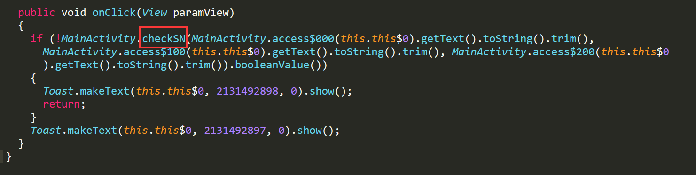
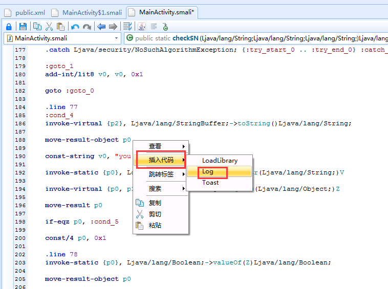
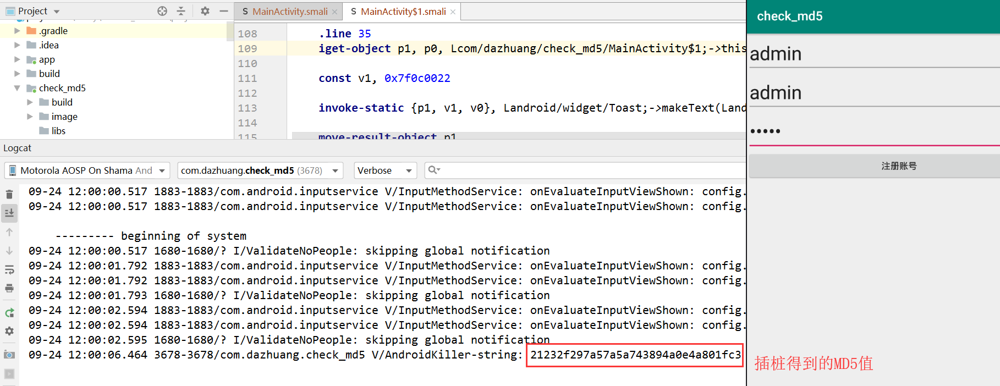

# reverse_android 从安卓开发到逆向
## check_md5 smali插桩
如果仅仅用Smali来分析代码，效果其实不如用dex2jar和jd-gui更直观，毕竟看反编译的java代码要更容易一些。但Smali强大之处就是可以随心所欲的进行插桩操作。何为插桩，引用一下wiki的解释：
```text
程序插桩，最早是由J.C. Huang 教授提出的，它是在保证被测程序原有逻辑完整性的基础上在程序中插入一些探针（又称为“探测仪”），通过探针的执行并抛出程序运行的特征数据，通过对这些数据的分析，可以获得程序的控制流和数据流信息，进而得到逻辑覆盖等动态信息，从而实现测试目的的方法。
```

#### 准备工具：
```text
android killer，android studio，Smalidea插件，夜神模拟器，adb，check_md5-release.apk
```
#### 工具下载地址：
```text
链接：https://pan.baidu.com/s/1mHOl9y-LXnETUg3oDAKNvA
提取码：3ygd
```
#### 步骤
首先开发一个简单的登录demo程序，要求输入用户名、邀请码、密码来完成账号的注册。  
  
##### 关键代码
```java
public class MainActivity extends AppCompatActivity {
    private EditText edit_userName,edit_password;
    private EditText edit_sn;
    private Button btn_register;

    @Override
    public void onCreate(Bundle savedInstanceState) {
        super.onCreate(savedInstanceState);
        setContentView(R.layout.activity_main);

        edit_userName = findViewById(R.id.username);
        edit_sn = findViewById(R.id.invitation);
        edit_password = findViewById(R.id.password);
        btn_register = findViewById(R.id.submit);

//        匿名类
        btn_register.setOnClickListener(new OnClickListener() {

            public void onClick(View v) {
//                注册失败
                if (!checkSN(edit_userName.getText().toString().trim(),edit_sn.getText().toString().trim(),edit_password.getText().toString().trim())){
                    Toast.makeText(MainActivity.this,
                            R.string.unsuccessed, Toast.LENGTH_SHORT).show();
                } else {
//                    注册成功
                    Toast.makeText(MainActivity.this,
                            R.string.successed, Toast.LENGTH_SHORT).show();
                }
            }
        });
    }

//    校验
    public static Boolean checkSN(String str,String SN,String password) {
        if (str == null || str.length() == 0) {
            return false;
        }

        if (password == null || password.length() == 0) {
            return false;
        }

        if (SN == null || SN.length() == 0) {
            return false;
        }

//        md5
        StringBuffer hexString = new StringBuffer();
        try {
            MessageDigest md = MessageDigest.getInstance("MD5");
            md.update(str.getBytes());
            byte[] hash = md.digest();
            for (int i = 0; i < hash.length; i++) {
                if ((0xff & hash[i]) < 0x10) {
                    hexString.append("0" + Integer.toHexString((0xFF & hash[i])));
                } else {
                    hexString.append(Integer.toHexString(0xFF & hash[i]));
                }
            }
        } catch (NoSuchAlgorithmException e) {
            e.printStackTrace();
            return false;
        }
        if (hexString.toString().equals(SN)){
            return true;
        }else{
            return false;
        }
    }
}
```
结果有两个：  
注册成功  
注册失败  

##### 反编译apk，找到邀请码生成逻辑。
根据注册失败时返回的提示，在android中搜索关键字。  
  
根据string的name值，找到string的ID值  
  
再根据ID值找到其所在的定义的代码段。  
  
此时可以点击JAVA图标，查看当前smali代码所对应的JAVA代码逻辑。如果当前工具显示源代码丢失，则需要使用dextojar工具重新反编译dex到jar。  
根据JAVA代码逻辑，可以看到在onClick方法中调用了checkSN方法，用于比对三个字符串变量，根据其返回的布尔值进行下一步Toast操作。  
  
根据checkSN方法可以得知其逻辑如下：  
1、首先判断三个字符串变量是否为空，如为空则直接return  
2、对paramString3进行MD5  
3、判断paramString3.toString()和paramString2是否相等  
根据这段checkSN的JAVA代码，我们假设不知道邀请码就是用户名的MD5值。我们可以得到本程序的突破口，我们只要拿到paramString3的MD5值，即拿到了邀请码。  
接下来，我们在android killer中对smali代码插桩。  
1、首先找到paramString3的MD5值返回处  
```java
move-result-object p0
```  
2、在他的后面点击鼠标右键，选择插入代码----log即可完成插桩。
  
3、完成插桩后如图所示，记得保存。  
  
4、使用android killer重新打包apk，将apk安装到夜神模拟器中运行  
5、打开android studio的logcat，查看相关日志，此时无论邀请码填入多少，我们都可以在日志中查看到用户名的MD5值了。  
  
6、在程序中中输入插桩得到的邀请码，即可注册成功。  

***
#### 微信公众号
不定期分享一些python爬虫,逆向破解相关文章,欢迎大家关注.  

***
BUG：dazhuang_python@sina.com