# reverse_android 从安卓开发到逆向
## Xposed框架入门
**准备工具：**
```
android studio，夜神模拟器，XposedInstaller_3.1.5.apk
```
**工具下载地址：**

```
链接：https://pan.baidu.com/s/1mHOl9y-LXnETUg3oDAKNvA
提取码：3ygd
```
***

**Xposed框架是什么东西？**
```
Xposed框架是在Android系统中使用最频繁的Hook框架，它支持Android Java层的Dalvik Hook与ART Hook，但可惜的是，他不支持Native层的Hook。
```
**Xposed框架的官方下载地址：**
```
https://repo.xposed.info/module/de.robv.android.xposed.installer
```
由于Xposed的版本更新比较频繁，在使用Xposed框架前，需要查询当前系统版本是否在Xposed支持的范围内。
**Xposed框架工作原理：**

```
它部署在ROOT后的安卓手机上，通过替换/system/bin/app_process程序控制zygote进程，使得app_process在启动过程中会加载XposedBridge.jar这个jar包，从而完成对Zygote进程及其创建的Dalvik虚拟机的劫持。可以让我们在不修改APK源码的情况下，通过自己编写的模块来影响程序运行的框架服务，实现类似于自动抢红包、微信消息自动回复等功能。
```

注意，在安装Xposed框架之前，必须要**ROOT**手机权限。

**Xposed框架功能实现：**
从本质上来讲，Xposed 模块也是一个 Android 程序。但与普通程序不同的是，想要让写出的Android程序成为一个Xposed 模块，需要以下几个步骤：
```
1、让手机上的xposed框架知道我们安装的这个程序是个xposed模块。
2、模块里要包含有xposed的API的jar包，以实现下一步的hook操作。
3、这个模块里面要有对目标程序进行hook操作的方法。
4、要让手机上的xposed框架知道，我们编写的xposed模块中，哪一个方法是实现hook操作的。
```
什么是**Hook**：
```
Hook 英文翻译过来就是「钩子」的意思，那我们在什么时候使用这个「钩子」呢？在 Android 操作系统中系统维护着自己的一套事件分发机制。应用程序，包括应用触发事件和后台逻辑处理，也是根据事件流程一步步地向下执行。而「钩子」的意思，就是在事件传送到终点前截获并监控事件的传输，像个钩子钩上事件一样，并且能够在钩上事件时，处理一些自己特定的事件。
```

***

Xposed框架的**安装**：
首先，我们需要将下载好的XposedInstaller_3.1.5.apk安装到夜神模拟器，此处选择的是夜神模拟器安卓系统为5.5.1版本。
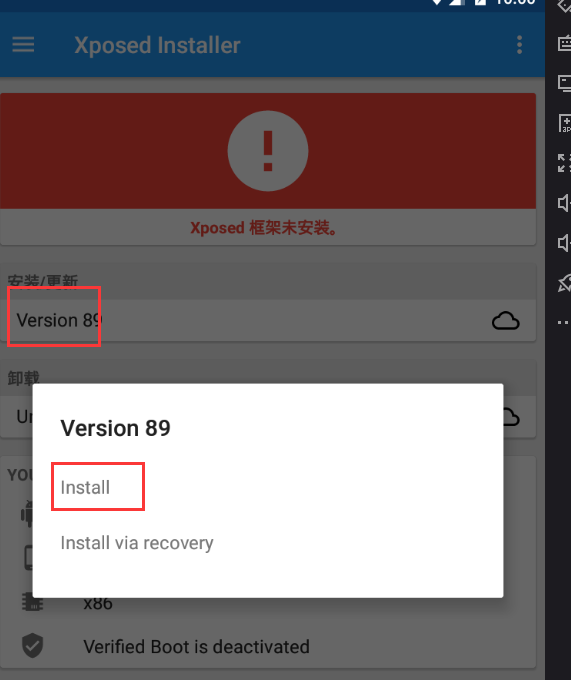
点击install后，会下载相应的Xposed框架，并进行安装。
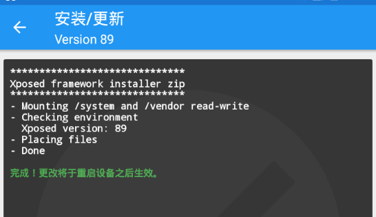
安装成功后需要**重启**夜神模拟器。

**开发一个小demo供Xposed框架Hook**：
界面很简单，就一个按钮，点击按钮后，demo下方会提示，**大壮python爬虫开发**。
代码为：
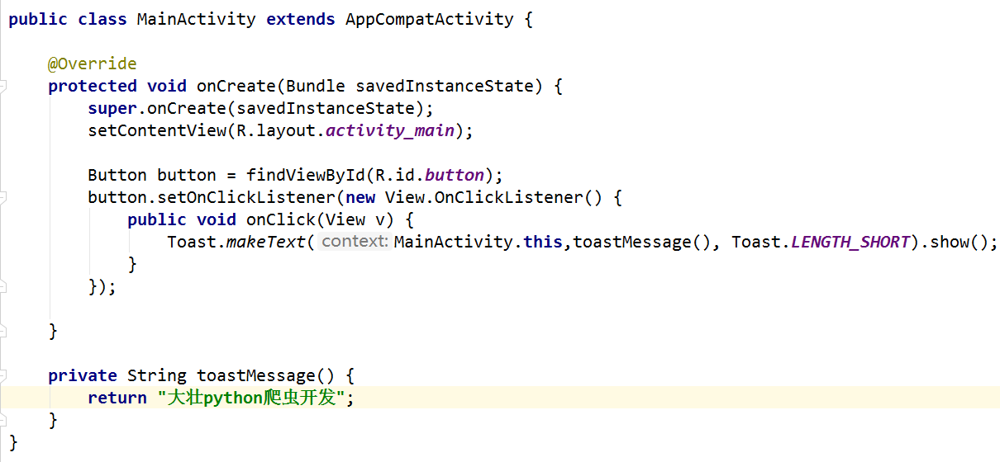
其显示效果为：

**开发Xposed Hook脚本：**

更改demo下方的提示，将其更改为，**安卓从开发到逆向**。

请严格按照如下步骤进行开发和修改：

1、可以新建一个项目或直接在本项目中开发

2、在**AndroidManifest.xml**文件中新增三行描述，注意其编辑位置：
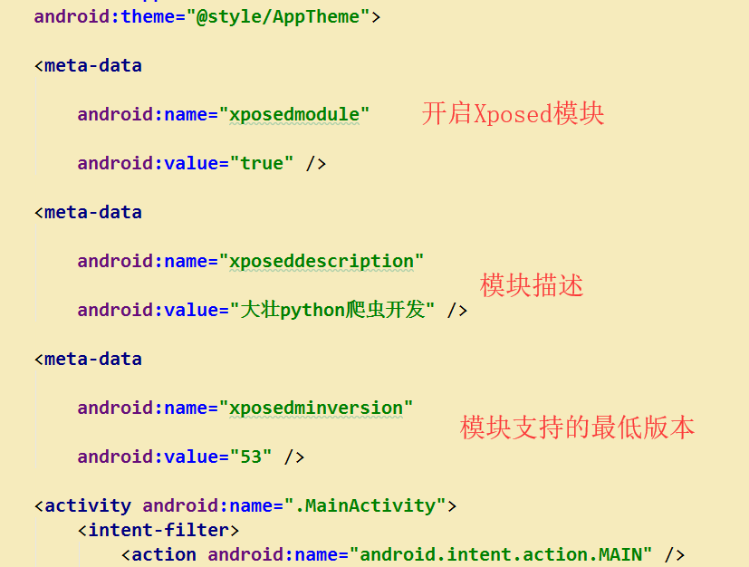
在第二步编辑完成后，可以运行本demo，当前能够在夜神模拟器的Xposed框架---模块中，看到该模块。
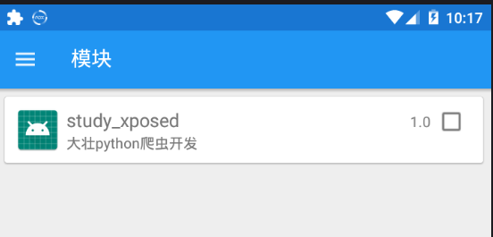
但当前该模块是一个**空白模块**，还需我们继续编辑，添加其功能。

3、编辑app下**build.gradle**文件
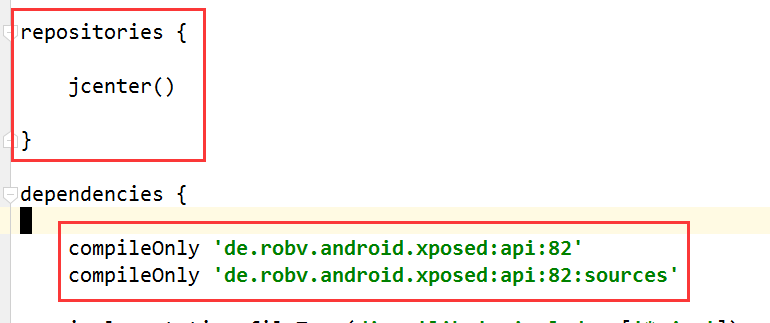
其意义为：这句代码是告诉AndroidStuido使用jcenter作为代码仓库，从这个仓库里远程寻找 de.robv.android.xposed:api:82 这个API。
4、配置android studio **科学上网**。
5、build.gradle会提示文件已经修改，是否同步。点击 “**sync now**”，同步即可。
6、开始编辑Hook代码：
在**MainActivity**同级目录新建java文件**HookTest**
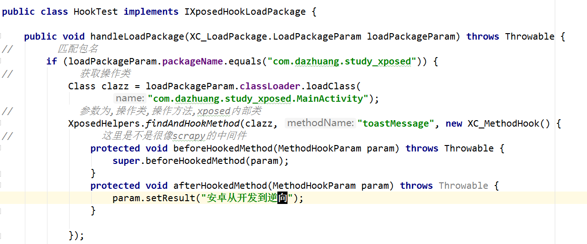
7、添加xposed Hook模块的入口点：
右键点击 "main" 文件夹 ， 选择new –> Folder –>Assets Folder，新建assets 文件夹：
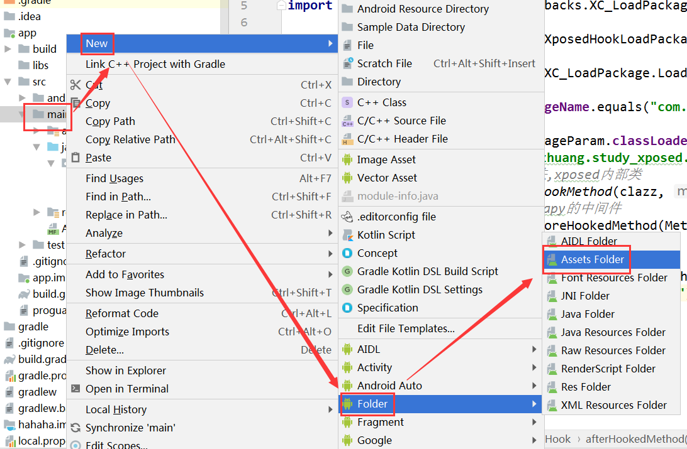
然后右键点击 assets文件夹， new–> file，文件名为xposed_init（文件类型选text），并编辑该文件：
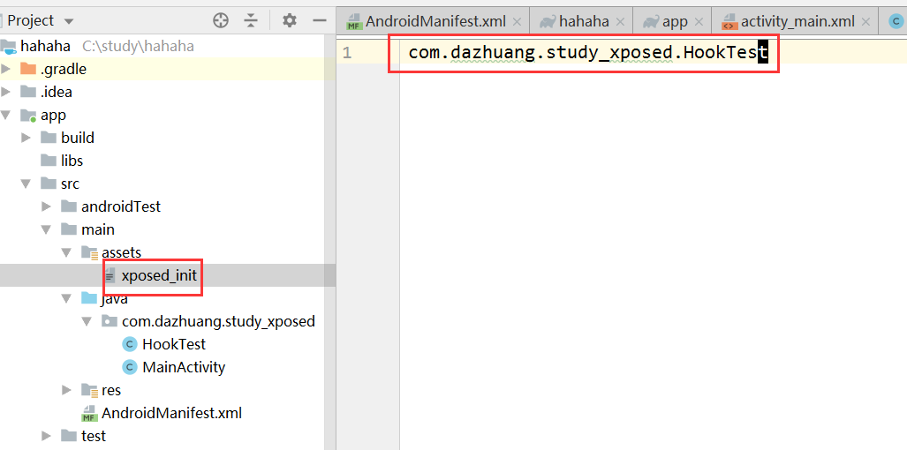
这样， Xposed框架就能够从这个 xposed_init 读取信息来找到模块的入口，然后进行Hook操作了。
8、最后选择禁用 Instant Run：单击 File -> Settings -> Build, Execution, Deployment -> Instant Run，把勾全部去掉。
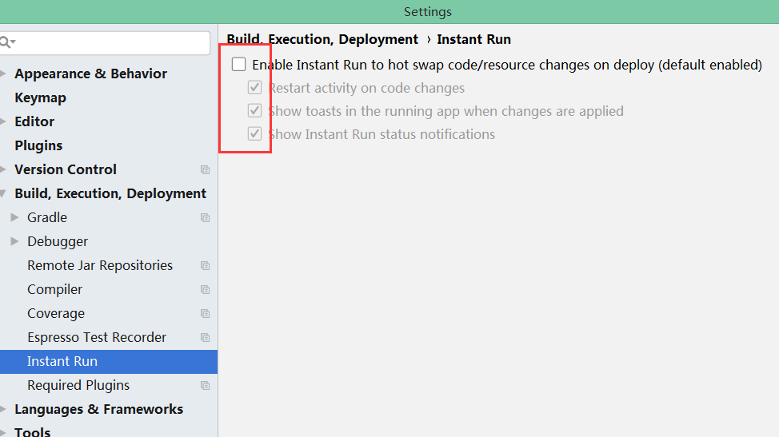
9、编译运行，并激活刚刚开发好的Xposed模块。
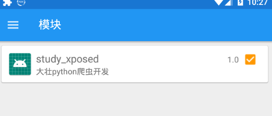
10、重启夜神模拟器，验证Hook效果

***
python爬虫工程师之家，不定期分享一些python爬虫开发技能及逆向破解相关知识，欢迎关注，一起学习，一起进步。

***
我在慕课网主讲的视频课程：
[Python爬虫工程师必学——App数据抓取实战](https://coding.imooc.com/class/283.html)
欢迎各位大神关注。

***
BUG：dazhuang_python@sina.com