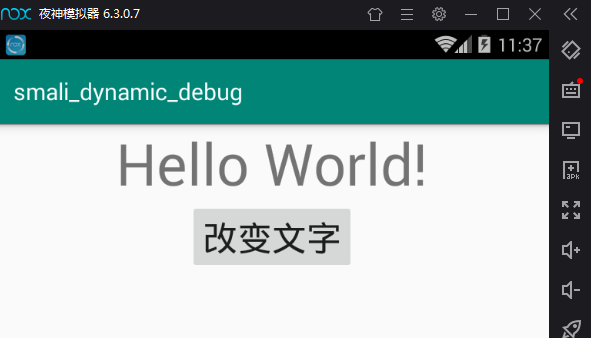
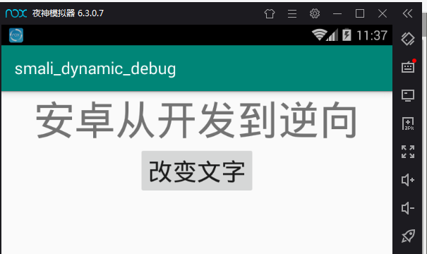
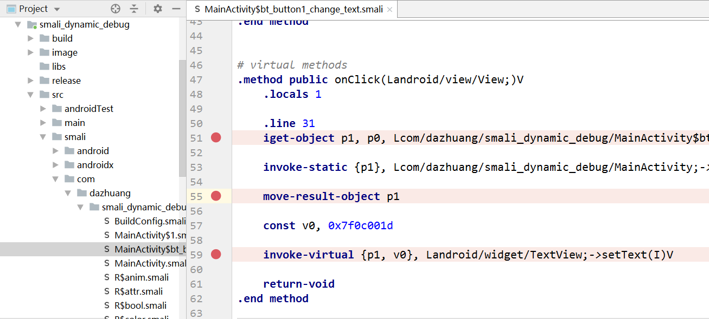
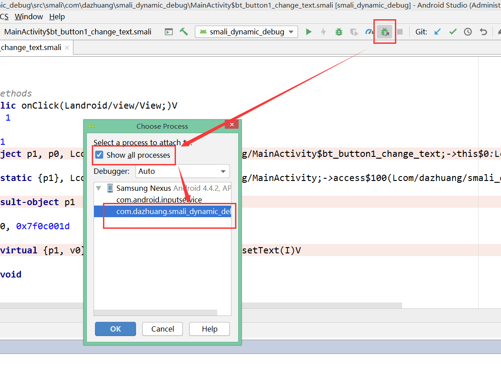
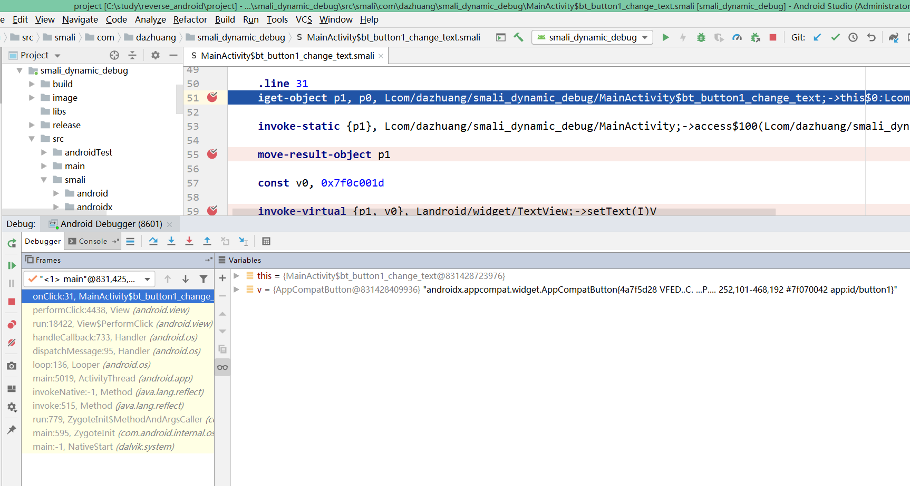

# reverse_android 从安卓开发到逆向
## smali_dynamic_debug smali动态调试，debug
### 准备工具
```text
android killer，android studio，夜神模拟器，adb
```
### 实现步骤
#### 1、开发相关app，实现点击按钮后改变文本  
改变前  
  
改变后  
  
#### 2、使用android killer逆向apk为smali  
#### 3、在AndroidManifest.xml中添加debug开关  
```xml
<?xml version="1.0" encoding="utf-8" standalone="no"?><manifest xmlns:android="http://schemas.android.com/apk/res/android" android:compileSdkVersion="29" android:compileSdkVersionCodename="10" package="com.dazhuang.check_md5" platformBuildVersionCode="29" platformBuildVersionName="10">
    <application android:debuggable="true" android:allowBackup="true" android:appComponentFactory="androidx.core.app.CoreComponentFactory" android:icon="@mipmap/ic_launcher" android:label="@string/app_name" android:roundIcon="@mipmap/ic_launcher_round" android:supportsRtl="true" android:theme="@style/AppTheme">
        <activity android:name="com.dazhuang.check_md5.MainActivity">
            <intent-filter>
                <action android:name="android.intent.action.MAIN"/>
                <category android:name="android.intent.category.LAUNCHER"/>
            </intent-filter>
        </activity>
    </application>
</manifest>
```  

#### 4、使用adb工具启动app  
```text
adb shell am start -D -n com.dazhuang.smali_dynamic_debug/.MainActivity
```
  
#### 5、拷贝smali代码到smali_dynamic_debug项目下  
#### 6、在smali代码中打断点  
  
#### 7、开启android studio的调试模式  
  
#### 8、点击改变文字按钮，开始调试  
  
***
#### 微信公众号
不定期分享一些python爬虫,逆向破解相关文章,欢迎大家关注.  

***
BUG：dazhuang_python@sina.com