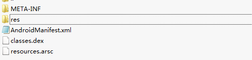
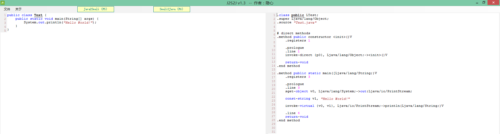

# smali笔记
## 20190921
### apk的生成
Java虚拟机运行的是Java字节码，Dalvik虚拟机运行的是Dalvik字节码。传统的java程序经过编译，生成java字节码并保存在class文件中，java虚拟机通过解码class文件的内容来运行程序，而dalvik虚拟机运行的是dalvik字节码，所有dalvik字节码由java字节码转换而来，并被打包到一个DEX可执行文件当中，dalvik虚拟机通过解释DEX文件来执行这些字节码。
### apk内部构造
  
META-INF  描述apk包信息的目录，主要存放了签名信息，配置信息，service注册信息  
res       存放apk资源文件的目录，比如图片，图标，字符串，样式，颜色等信息  
assets    同样是存放apk资源的目录，和res有差异，不重要  
resources.arsc  资源索引，包含不同语言环境中res目录下所有资源的类型，名称与ID所对应的信息  
lib   存放so文件，越来越多的应用由C/C++编写核心代码，以SO文件的形式供上层JAVA代码调用，以保证安全，这个目录是逆向的重点目录  
AndroidManifest.xml   清单文件，包含了APP大量的配置信息，包名，应用权限等。打开后乱码，因为清单文件在apk打包过程中被编译成了二进制格式文件  
classes.dex   android程序通过dex格式的可执行文件运行在dalvik虚拟机上，和windows下的exe类似，我们可以通过反编译dex获取apk伪代码  
### 从apk逆向到smali工具
1、android killer  
2、android逆向助手(只能在MAC系统上使用)  
### java和smali互转工具
1、J2S2J  java和smali互转  
  
### smali相关知识点
[深入理解 Dalvik 字节码指令及 Smali 文件](https://juejin.im/entry/579ef6e37db2a2005a6350d8)  
必看[Android smali语法](https://blog.csdn.net/rozol/article/details/88368358)  
### java和smali对比  
```java
public class Hello{
    public int foo(int a,int b){
        return (a+b)*(a-b);    
    };

    public static void main(String[] args){
        Hello hello = new Hello();
        System.out.println(hello.foo(5,3));
    };
};
```
```java
.class public LHello;
.super Ljava/lang/Object;
.source "Hello.java"


# direct methods
// 构造方法
.method public constructor <init>()V
    .registers 1

    .prologue
    .line 1
    invoke-direct {p0}, Ljava/lang/Object;-><init>()V

    return-void
.end method

// 静态主方法，L是对象，参数是string字符串
.method public static main([Ljava/lang/String;)V
    .registers 5

    .prologue
    // 定位到原java文件的第七行
    .line 7
    // 创建实例
    new-instance v0, LHello;

    invoke-direct {v0}, LHello;-><init>()V

    .line 8
    // sput是对静态字段写操作，sget是对静态字段读操作。iput和iget是面对普通字段。
    sget-object v1, Ljava/lang/System;->out:Ljava/io/PrintStream;
    //定义两个常量
    const/4 v2, 0x5

    const/4 v3, 0x3
    // 调用方法
    invoke-virtual {v0, v2, v3}, LHello;->foo(II)I
    // 将结果传递给v0
    move-result v0
    // 调用System.out.println方法
    invoke-virtual {v1, v0}, Ljava/io/PrintStream;->println(I)V

    .line 9
    // 方法返回
    return-void
.end method


# virtual methods
.method public foo(II)I
    .registers 5

    .prologue
    .line 3
    // 调用求和指令,p1+p2，返回给v0
    add-int v0, p1, p2
    // 调用减法，p1-p2,返回给v1
    sub-int v1, p1, p2
    // 调用乘法,v0*v1，返回给v0
    mul-int/2addr v0, v1

    return v0
.end method
```
```java
public class for_test {
    
    public void for_test_method() {
        for(int a = 0;a<10;a++) {
            System.out.println(a);
        };
    };

    public static void main(String[] args) {
        // TODO Auto-generated method stub
        for_test test = new for_test();
        test.for_test_method();
    }

}
```
```java
.class public Lfor_test;
.super Ljava/lang/Object;
.source "for_test.java"


# direct methods
// 构造方法
.method public constructor <init>()V
    .registers 1

    .prologue
    .line 1
    invoke-direct {p0}, Ljava/lang/Object;-><init>()V

    return-void
.end method
// 静态主方法，L是对象，参数是string字符串
.method public static main([Ljava/lang/String;)V
    .registers 2

    .prologue
    .line 11
    // 创建实例，对象为for_test，保存在v0
    new-instance v0, Lfor_test;

    invoke-direct {v0}, Lfor_test;-><init>()V

    .line 12
    // 调用方法for_test_method
    invoke-virtual {v0}, Lfor_test;->for_test_method()V

    .line 13
    return-void
.end method


# virtual methods
.method public for_test_method()V
    .registers 3

    .prologue
    .line 4
    // 定义常量,0x0是0，0xa是10
    const/4 v0, 0x0

    :goto_1
    const/16 v1, 0xa
    // 如果v0大于等于v1，返回值为cond_d
    if-ge v0, v1, :cond_d

    .line 5
    sget-object v1, Ljava/lang/System;->out:Ljava/io/PrintStream;

    invoke-virtual {v1, v0}, Ljava/io/PrintStream;->println(I)V

    .line 4
    // for循环内部的加法
    add-int/lit8 v0, v0, 0x1
    // 满足条件，继续循环
    goto :goto_1

    .line 7
    // 不满足条件
    :cond_d
    return-void
.end method
```
文中涉及到的软件下载:  
```text
链接：https://pan.baidu.com/s/1mHOl9y-LXnETUg3oDAKNvA 
提取码：3ygd
```
参考文章:  
《android软件安全权威指南》  
[Smali介绍与学习](https://mp.weixin.qq.com/s/JN6tl85N3tGx5XW4Wu7Y9Q)  
[Android smali语法](https://blog.csdn.net/rozol/article/details/88368358)  
***
BUG：dazhuang_python@sina.com